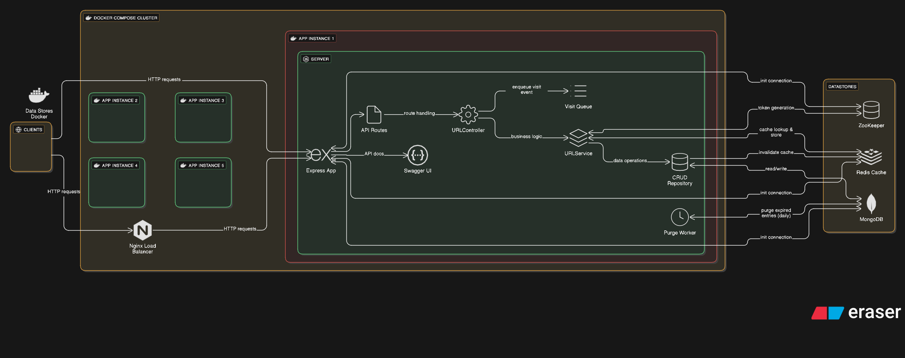

# 🌀 URLHub

**URLHub** is a high-performance, scalable, and distributed URL shortener built with Node.js, Redis, ZooKeeper, and MongoDB. It supports advanced features like:

- One-time links
- Expiry-based short URLs
- Password-protected redirection
- Cached short URLs using Redis
- QR code generation for easy sharing
- Horizontally scalable architecture using distributed ID generation

---

## 🔗 Architecture Overview

URLHub follows a distributed system architecture using:

- **ZooKeeper** for consistent, distributed token range allocation.
- **Redis** for caching and rapid short URL lookup.
- **MongoDB** to persist short URL metadata.
- **Express.js** as the backend HTTP server.
- **Next.js** for the frontend (UI).
- **Fast-CSV** for optional bulk input/output.

### 🔗 Flow of Short URL Generation

1. ZooKeeper assigns a unique token range to each backend instance.
2. Tokens are converted to base62 hashes.
3. Metadata is saved to MongoDB and cached in Redis.
4. A QR code is generated for the shortened URL.

### 🔗 Flow of Short URL Redirection

When a user accesses a short URL:

- Redis is checked first for cached metadata.
- If not found, MongoDB is queried and data is cached.
- Password and expiry are validated.
- One-time links are deleted after use.

---

## ⚙️ Tech Stack

| Tech       | Purpose                      |
| ---------- | ---------------------------- |
| Node.js    | Backend runtime              |
| Express.js | REST API framework           |
| MongoDB    | URL metadata storage         |
| Redis      | URL caching                  |
| ZooKeeper  | Distributed token management |
| Fast-CSV   | Bulk CSV operations          |
| Next.js    | Frontend framework           |
| TypeScript | Safer JavaScript             |
| Swagger UI | API Documentation            |
| Winston    | Logger                       |

---

## 🔗 Features

- ✅ Custom short URL generation
- ✅ Password-protected URLs
- ✅ Expiry-based redirection
- ✅ One-time access links
- ✅ Redis-based caching for fast lookup
- ✅ Distributed token generation using ZooKeeper
- ✅ QR code generation for each short URL
- ✅ Scalable microservices-ready backend
- ✅ Frontend UI built with Next.js

---

## 🔗 Planned Features

- ❌ Visit count tracking using Redis-backed queue
- ❌ User authentication with JWT
- ❌ Analytics dashboard per user
- ❌ Bulk CSV upload for short URLs
- ❌ Docker & Docker Compose support

---

## 🛠️ Setup Instructions

### Frontend is hosted at `https://distro-url.vercel.app`

### 1. Prerequisites

- Node.js >= 18
- MongoDB instance
- Redis instance
- ZooKeeper instance

### 2. Clone the repository

```bash
git clone https://github.com/alucard017/URLHub.git
cd URLHub
```

### 3. Add .env file in your backend like this or template provided by ` .env.sample`

```
PORT="port your want to run"
REDIS_HOST="your redis host"
REDIS_PORT="your redis port"
LOG_LEVEL="info"
ZK_SERVER="your zookeeper server URL"
MONGODB_URI="your mongodb URL"
BASE_URL="your base URL"

```

Note that the BASE_URL is the URL where you backend is running, it may be `localhost:PORT` or if running in any VPS then `<VPS_PUBLIC_IP>:PORT`.

### 4. If you have docker

Set up the environments correctly first using any of the two :

- by editing the environment
- by importing .env file from backend folder.

Simply run this command on root directory(i.e not inside backend or frontend)

```
docker-compose up --build -d
```

You can view the logs on backend by

```
docker compose logs -f backend
```

### 5. If you don't have docker

Then simply go inside backend directory by

```
cd backend
```

Run the following command with correct `.env` set.

```
npm run dev
```

Now your backend will correctly be running either in `VPS` or in `localhost`

```
